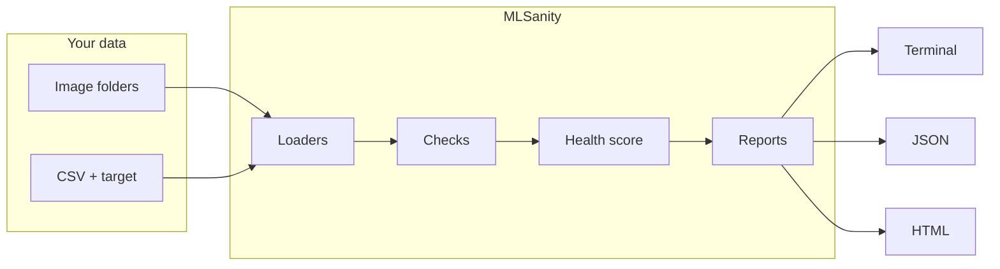

<div align="center">


# MLSanity

**Sanity-check your dataset before training your model.**

[](https://www.python.org/)
[](LICENSE)
[](https://typer.tiangolo.com/)
[](https://rich.readthedocs.io/)

</div>

---

MLSanity is an open-source **dataset sanity-checking** toolkit for **image classification** folders and **tabular CSV** files. Run one command, get a **colorized terminal summary**, optional **JSON** and **HTML** reports, and a simple **health score** so you catch data issues before you waste GPU time.

**Current release:** `v0.1.1` (MVP)

## Why MLSanity?

| Without MLSanity                             | With MLSanity                                                    |
| -------------------------------------------- | ---------------------------------------------------------------- |
| Spot-check a few files by hand               | Scan **every** image row / file the loaders see                  |
| Duplicates and leakage hide in large folders | **Exact** and **near-duplicate** checks, **cross-split** leakage |
| “Looks fine” in a notebook                   | **Structured checks** + **scores** + exportable **reports**      |
| Hard to share findings with a team           | **JSON / HTML** artifacts you can attach to PRs or tickets       |

## Features at a glance

| Capability                                                 | v0.1          |
| ---------------------------------------------------------- | ------------- |
| Image classification folders (split-based or flat classes) | Yes           |
| Tabular CSV with `--target` (optional `--split-column`)    | Yes           |
| Corruption, duplicates, near-duplicates, imbalance         | Yes           |
| Schema + tabular duplicates + leakage                      | Yes           |
| Terminal (Rich), JSON, HTML reports                        | Yes           |
| Train/val **leakage** when splits exist                    | Yes           |
| Web dashboard, plugins, auto-fix                           | _Not in v0.1_ |

## How it works



**Pipeline in words:** loaders turn paths into `Sample` objects → checks produce `CheckResult`s → scoring derives a 0–100 **health score** and status band → reporting prints to the terminal and optionally writes **JSON** / **HTML**.

## Requirements

- **Python 3.11+**

## Install

```bash
git clone https://github.com/gkxvall/MLSanity.git
cd MLSanity
python -m pip install -e .
```

## Quick usage

### Image classification

```bash
mlsanity doctor /path/to/dataset --type image
```

### Tabular CSV

```bash
mlsanity doctor /path/to/data.csv --type tabular --target target_column
```

Optional split column (enables cross-split leakage checks):

```bash
mlsanity doctor /path/to/data.csv --type tabular --target target_column --split-column split
```

### Export reports

```bash
mlsanity doctor /path/to/data --type image \
  --json report.json \
  --html report.html
```

The CLI uses **Rich** for tables, panels, and colored status in the terminal.

### Version

```bash
mlsanity version
```

## Supported layouts

**Images — split folders**

```text
dataset/
  train/
    cat/
    dog/
  val/
    cat/
    dog/
```

**Images — flat class folders**

```text
dataset/
  cat/
  dog/
```

## What v0.1 checks

| Area    | Check             | What it does                                              |
| ------- | ----------------- | --------------------------------------------------------- |
| Images  | `corruption`      | Zero-byte files; unreadable / invalid images (Pillow)     |
| Images  | `duplicates`      | Exact duplicates via **SHA-256** of file bytes            |
| Images  | `near_duplicates` | **pHash** + Hamming distance grouping                     |
| Images  | `imbalance`       | Class counts, %, imbalance ratio                          |
| Images  | `leakage`         | Same file hash in **more than one split**                 |
| Images  | `leakage_near`    | Near-duplicate **pairs across splits**                    |
| Tabular | `schema`          | Missing values, empty columns, constant columns           |
| Tabular | `duplicates`      | Exact duplicate rows; conflicting labels on same features |
| Tabular | `imbalance`       | Same metrics on the **target** column                     |
| Tabular | `leakage`         | Same **feature row** under **more than one split**        |

If there are **no splits** (e.g. flat image layout), cross-split leakage checks return **OK** with a short “skipped” explanation.

## Health score & status bands

The score starts at **100** and applies **penalties** for warnings/errors from checks, then clamps to **0–100**.

| Check (when not OK)            | Approx. penalty |
| ------------------------------ | --------------- |
| `corruption`                   | −20             |
| `leakage`                      | −25             |
| `leakage_near`                 | −15             |
| `duplicates` (warning / error) | −10 / −15       |
| `near_duplicates`              | −10             |
| `imbalance`                    | −15             |
| `schema`                       | −10 / −15       |

| Score  | `overall_status`  |
| ------ | ----------------- |
| 90–100 | `healthy`         |
| 70–89  | `acceptable`      |
| 40–69  | `needs_attention` |
| 0–39   | `critical`        |

## Report outputs compared

| Output       | Best for                                     |
| ------------ | -------------------------------------------- |
| **Terminal** | Fast feedback; colored summary in your shell |
| **JSON**     | Scripts, CI, dashboards, custom tooling      |
| **HTML**     | Sharing with teammates; opening in a browser |

## Project layout

```text
mlsanity/
  cli.py                 # Typer CLI (Rich output)
  engine.py              # Orchestrates loaders, checks, scoring
  types.py               # Sample, CheckResult, Report
  loaders/               # image_loader, tabular_loader
  checks/                # corruption, duplicates, near_duplicates, imbalance, schema, leakage
  reporting/             # terminal, json_report, html_report, scoring, templates/
examples/                # sample CSV + notes
tests/                   # pytest
logo.png                 # Logo for README (keep at repo root next to README.md)
```

## Examples

See [`examples/README.md`](examples/README.md) and [`examples/sample_tabular.csv`](examples/sample_tabular.csv).

## Tests

```bash
python -m pip install pytest
python -m pytest tests/ -v
```

## Roadmap (not v0.1)

- Suspicious-label hints, dataset **comparison** mode, richer plots in reports
- Hugging Face / more formats, CI integrations — see project issues when published

## License

MIT — see [`LICENSE`](LICENSE).
